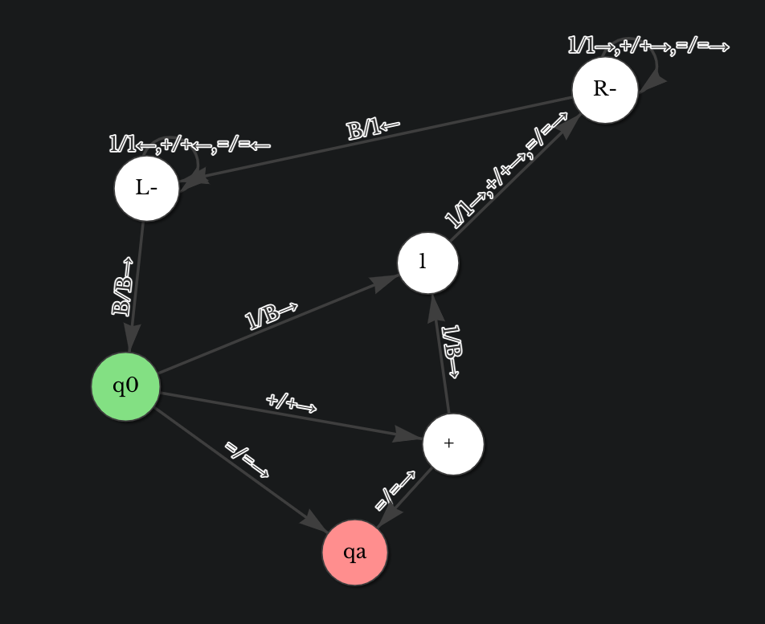

定义：图灵机是一个 7 元组 $M = \{Q, \sum , \Gamma, \delta, q_0, q_{accept}, q_{reject}\}$。
其中，
1. $Q$ 是一个状态集合；
2. $\sum$ 是一个是输入字母表，其中不包含特殊的空白符；
3. $\Gamma$ 是带字母表，其中 $Q \in \Gamma$ 且 $\sum \in \Gamma$；
4. $\delta: Q \times \Gamma \to Q \times \Gamma \times \{L, R\}$ 是转移函数，其中 $L,R$ 表示读写头是向左移还是向右移；
5. $q_0 \in Q$ 是起始状态；
6. $q_{accept}$ 是接受状态；
7. $q_{reject}$ 是拒绝状态，且 $q_{reject}\neq q_{accept}$；
图灵机包含一个读写头、一个有限状态转移图、一个无限长的纸带。空用 $B$ 表示，并且平台的格式要示类似如下：

```txt
q0, B, 0, R, q1
q1, B, 1, L, qa
```

使用[网站](https://ecui.gitee.io/automata-playground/tm)的可视化操作。json 至提交所用的程序的转换凭以下的规则：
1. 输出为多行 `name, char, replace, move, toname`的形式；
2. 规定 `name` 为 `q0` 若 `type = 0`；`name` 为 `qa` 若 `type = 2`；`type = 1` 时，`name` 就是 `type`。
3. `char` 与 `move` 与文件内容一致。
4. `toname` 是用第二条相同的规则转换后的 `toId`。

这是写好的 `.py`
```python
import json

filename = input()
# filename = 'tm.json'

with open(filename, 'r') as file:
    data = json.load(file)

i = 1
states = data['states']
for state in states:
    if state['type'] == 1:
        state['name'] = "q" + str(i)
        i+=1
    if state['type'] == 0:
        state['name'] = "q0"
    if state['type'] == 2:
        state['name'] = "qa"
for state in states:
    for transition in state['transitions']:
        toId = transition['toId']
        name = state['name']
        for state2 in states: # 找到 to_name
            if(state2['id'] == toId):
                toname = state2['name']
                for move in transition['moves']:
                    char = move['char']
                    replace = move['replace']
                    move_char = move['move']
                    print(f'{name}, {char}, {replace}, {move_char}, {toname}')
```

作业一：实现形如 `1+111 = 1111` 的个数相加的图灵机。最简想法是这样的：



即如果初始状态下有 `1`，则移动到最右端增加一个 `1`，然后再移动到最左端回到初始状态；若有 `+` 或 `=` 可直接跳过。

```txt
q0, 1, B, R, q4
q0, +, +, R, q1
q0, =, =, R, qa
q1, =, =, R, qa
q1, 1, B, R, q4
q2, 1, 1, R, q2
q2, +, +, R, q2
q2, =, =, R, q2
q2, B, 1, L, q3
q3, B, B, R, q0
q3, 1, 1, L, q3
q3, +, +, L, q3
q3, =, =, L, q3
q4, 1, 1, R, q2
q4, +, +, R, q2
q4, =, =, R, q2
```