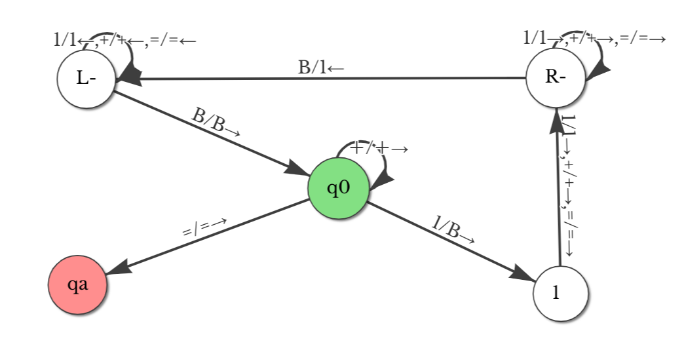
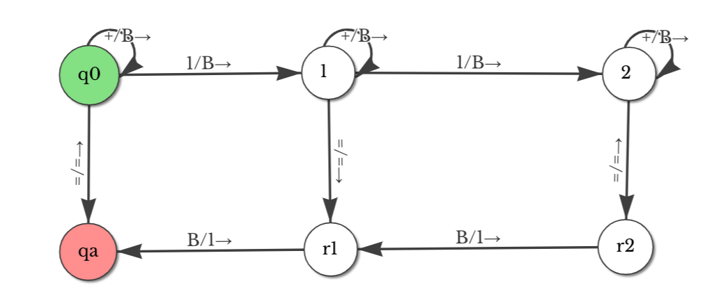
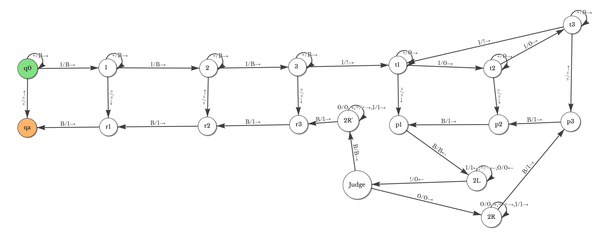
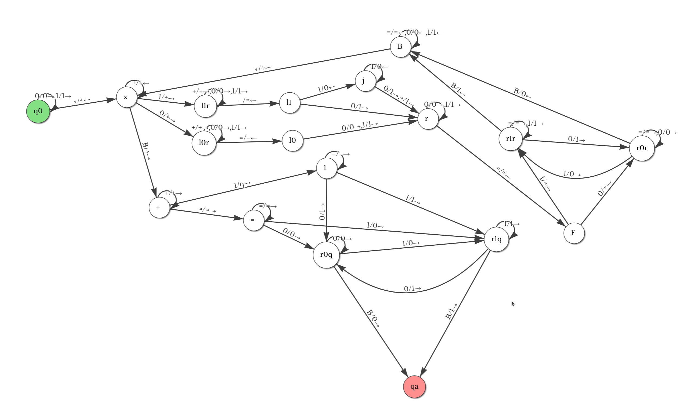
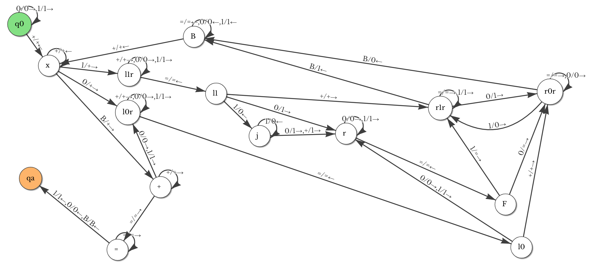
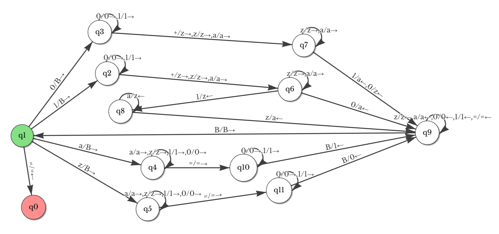

定义：图灵机是一个 7 元组 $M = \{Q, \sum , \Gamma, \delta, q_0, q_{accept}, q_{reject}\}$。
其中，
1. $Q$ 是一个状态集合；
2. $\sum$ 是一个是输入字母表，其中不包含特殊的空白符；
3. $\Gamma$ 是带字母表，其中 $Q \in \Gamma$ 且 $\sum \in \Gamma$；
4. $\delta: Q \times \Gamma \to Q \times \Gamma \times \{L, R\}$ 是转移函数，其中 $L,R$ 表示读写头是向左移还是向右移；
5. $q_0 \in Q$ 是起始状态；
6. $q_{accept}$ 是接受状态；
7. $q_{reject}$ 是拒绝状态，且 $q_{reject}\neq q_{accept}$；
图灵机包含一个读写头、一个有限状态转移图、一个无限长的纸带。空用 $B$ 表示，并且平台的格式要示类似如下：

```txt
q0, B, 0, R, q1
q1, B, 1, L, qa
```

使用[网站](https://ecui.gitee.io/automata-playground/tm)的可视化操作。json 至提交所用的程序的转换凭以下的规则：
1. 输出为多行 `name, char, replace, move, toname`的形式；
2. 规定 `name` 为 `q0` 若 `type = 0`；`name` 为 `qa` 若 `type = 2`；`type = 1` 时，`name` 就是 `type`。
3. `char` 与 `move` 与文件内容一致。
4. `toname` 是用第二条相同的规则转换后的 `toId`。

这是写好的 `.py`
```python
import json

filename = input()
# filename = 'tm.json'

with open(filename, 'r') as file:
    data = json.load(file)

i = 1
states = data['states']
for state in states:
    if state['type'] == 1:
        state['name'] = "q" + str(i)
        i+=1
    if state['type'] == 0:
        state['name'] = "q0"
    if state['type'] == 2:
        state['name'] = "qa"
for state in states:
    for transition in state['transitions']:
        toId = transition['toId']
        name = state['name']
        for state2 in states: # 找到 to_name
            if(state2['id'] == toId):
                toname = state2['name']
                for move in transition['moves']:
                    char = move['char']
                    replace = move['replace']
                    move_char = move['move']
                    print(f'{name}, {char}, {replace}, {move_char}, {toname}')
```

作业一：实现形如 `1+111 = 1111` 的个数相加的图灵机。最简想法是这样的：



即如果初始状态下有 `1`，则移动到最右端增加一个 `1`，然后再移动到最左端回到初始状态；若有 `+` 或 `=` 可直接跳过。

```txt
q0, 1, B, R, q3
q0, =, =, R, qa
q0, +, +, R, q0
q1, 1, 1, R, q1
q1, +, +, R, q1
q1, =, =, R, q1
q1, B, 1, L, q2
q2, B, B, R, q0
q2, 1, 1, L, q2
q2, +, +, L, q2
q2, =, =, L, q2
q3, 1, 1, R, q1
q3, +, +, R, q1
q3, =, =, R, q1
```
现考虑时间复杂度最低的情况（即满足步数最少的情况）。最优情况显然是读写头只从左向右扫一遍，并在最右端停下。想法是用状态代表内存。如下图，右端向右延伸。



对应的代码为
```txt
q0, =, =, R, qa
q0, +, B, R, q0
q0, 1, B, R, q1

q1, +, B, R, q1
q1, 1, B, R, q2
q1, =, =, R, r1
r1, B, 1, R, qa

q2, +, B, R, q2
q2, =, =, R, r2
q2, 1, B, R, q3
r2, B, 1, R, r1
……
```
因为 TM 的状态是有限的，因此 `qn` 中的 `n` 总有一个上限，则总需要到某个程度进行存数并折返。



这图对应的代码如下：
```txt
q0, =, =, R, qa
q0, +, B, R, q0
q0, 1, B, R, q1
q1, +, B, R, q1
q1, 1, B, R, q2
q1, =, =, R, q3
q2, +, B, R, q2
q2, =, =, R, q4
q2, 1, B, R, q5
q3, B, 1, R, qa
q4, B, 1, R, q3
q5, +, B, R, q5
q5, =, =, R, q6
q5, 1, !, R, q7
q6, B, 1, R, q4
q7, +, 0, R, q7
q7, =, =, R, q8
q7, 1, 0, R, q9
q8, B, B, L, q13
q9, +, 0, R, q9
q9, =, =, R, q10
q9, 1, 0, R, q11
q10, B, 1, R, q8
q11, 1, !, R, q7
q11, =, =, R, q12
q11, +, 0, R, q11
q12, B, 1, R, q10
q13, 1, 1, L, q13
q13, =, =, L, q13
q13, 0, 0, L, q13
q13, !, 0, L, q14
q14, 0, 0, R, q15
q14, B, B, R, q16
q15, 0, 0, R, q15
q15, =, =, R, q15
q15, 1, 1, R, q15
q15, B, 1, R, q12
q16, 0, 0, R, q16
q16, =, =, R, q16
q16, 1, 1, R, q16
q16, B, 1, R, q6
```

可以用 python 脚本用相同规则生成更大的图，进而让绝大多数样例达到理论最优解。并且，由于平台的步骤不会超过 10000 行，且有 $\displaystyle \sum_{i=1}^{140} = 9730$，因此可以生成 `m=140, n=3` 的脚本，时间复杂度一定为 `O(1)`的。

这是生成脚本的 `python` 代码。
```python
m = int(input())
n = int(input())

# 左部分
print("q0, =, =, R, qa\nq0, +, B, R, q0\nq0, 1, B, R, q1\nq1, +, B, R, q1\nq1, 1, B, R, q2\nq1, =, =, R, r1\nr1, B, 1, R, qa")

for i in range(2, m):
    print("q" + str(i) + ", +, B, R, q" + str(i) )
    print("q" + str(i) + ", 1, B, R, q" + str(i+1) )
    print("q" + str(i) + ", =, =, R, r" + str(i) )
    print("r" + str(i) + ", B, 1, R, r" + str(i-1))

# 左部分至右部分（图中的 3 -> t1）（第一和最后一个需要特判）
print("q" + str(m) + ", +, B, R, q" + str(m) )
print("q" + str(m) + ", 1, !, R, t" + str(1) )
print("q" + str(m) + ", =, =, R, r" + str(m) )
print("r" + str(m) + ", B, 1, R, r" + str(m-1))

print("t" + str(1) + ", +, 0, R, t" + str(1) )
print("t" + str(1) + ", 1, 0, R, t" + str(2) )
print("t" + str(1) + ", =, =, R, p" + str(1) )

# 现在是右部分
for i in range(2, n):
    print("t" + str(i) + ", +, 0, R, t" + str(i) )
    print("t" + str(i) + ", 1, 0, R, t" + str(i+1) )
    print("t" + str(i) + ", =, =, R, p" + str(i) )
    print("p" + str(i) + ", B, 1, R, p" + str(i-1))

# 对最后的特判
print("t" + str(n) + ", +, 0, R, t" + str(n) )
print("t" + str(n) + ", 1, !, R, t" + str(1) )
print("t" + str(n) + ", =, =, R, p" + str(n) )
print("p" + str(n) + ", B, 1, R, p" + str(n-1))

# 下面的处理
print("p1, B, B, L, toLeft")
print("toLeft, 1, 1, L, toLeft")
print("toLeft, =, =, L, toLeft")
print("toLeft, 0, 0, L, toLeft")
print("toLeft, !, 0, L, Judge")
print("Judge, B, B, R, toR1")
print("Judge, 0, 0, R, toR2")
print("toR1, 0, 0, R, toR1")
print("toR1, =, =, R, toR1")
print("toR1, 1, 1, R, toR1")
print("toR1, B, 1, R, r"+str(n))
print("toR2, 0, 0, R, toR2")
print("toR2, =, =, R, toR2")
print("toR2, 1, 1, R, toR2")
print("toR2, B, 1, R, p"+str(n))
```


作业二，思路一：


每次分别读最后一位，如果需要进位就进，然后取后面的一个数的最后一位挪到等号后。含有前导 0 的情况需要特判。

对应的代码为
```txt
q0, 0, 0, R, q0
q0, 1, 1, R, q0
q0, +, +, L, q1
q1, +, +, L, q1
q1, 0, +, R, q3
q1, 1, +, R, q2
q1, B, +, R, q12
q2, +, +, R, q2
q2, 0, 0, R, q2
q2, 1, 1, R, q2
q2, =, =, L, q4
q3, +, +, R, q3
q3, 0, 0, R, q3
q3, 1, 1, R, q3
q3, =, =, L, q5
q4, 1, 0, L, q6
q4, 0, 1, R, q7
q5, 0, 0, R, q7
q5, 1, 1, R, q7
q6, 1, 0, L, q6
q6, 0, 1, R, q7
q6, +, 1, R, q7
q7, 0, 0, R, q7
q7, 1, 1, R, q7
q7, =, =, L, q8
q8, 0, =, R, q9
q8, 1, =, R, q10
q9, =, =, R, q9
q9, 0, 0, R, q9
q9, B, 0, L, q11
q9, 1, 0, R, q10
q10, =, =, R, q10
q10, 1, 1, R, q10
q10, B, 1, L, q11
q10, 0, 1, R, q9
q11, =, =, L, q11
q11, 0, 0, L, q11
q11, 1, 1, L, q11
q11, +, +, L, q1
q12, +, +, R, q12
q12, =, =, R, q13
q12, 1, q, R, q16
q13, =, =, R, q13
q13, 1, 0, R, q14
q13, 0, 0, R, q15
q14, 1, 1, R, q14
q14, 0, 1, R, q15
q14, B, 1, R, qa
q15, 0, 0, R, q15
q15, 1, 0, R, q14
q15, B, 0, R, qa
q16, =, =, R, q16
q16, 1, 1, R, q14
q16, 0, 1, R, q15
```
共 54 行。

稍加修改，就是第三题的代码：


```txt
q0, 0, 0, R, q0
q0, 1, 1, R, q0
q0, +, +, L, q1
q1, +, +, L, q1
q1, 0, +, R, q3
q1, 1, +, R, q2
q1, B, +, R, q12
q2, +, +, R, q2
q2, 0, 0, R, q2
q2, 1, 1, R, q2
q2, =, =, L, q4
q3, +, +, R, q3
q3, 0, 0, R, q3
q3, 1, 1, R, q3
q3, =, =, L, q5
q4, 1, 0, L, q6
q4, 0, 1, R, q7
q4, +, +, R, q10
q5, 0, 0, R, q7
q5, 1, 1, R, q7
q5, +, +, R, q9
q6, 1, 0, L, q6
q6, 0, 1, R, q7
q6, +, 1, R, q7
q7, 0, 0, R, q7
q7, 1, 1, R, q7
q7, =, =, L, q8
q8, 0, =, R, q9
q8, 1, =, R, q10
q9, =, =, R, q9
q9, 0, 0, R, q9
q9, B, 0, L, q11
q9, 1, 0, R, q10
q10, =, =, R, q10
q10, 1, 1, R, q10
q10, B, 1, L, q11
q10, 0, 1, R, q9
q11, =, =, L, q11
q11, 0, 0, L, q11
q11, 1, 1, L, q11
q11, +, +, L, q1
q12, +, +, R, q12
q12, =, =, R, q13
q12, 0, 0, R, q3
q12, 1, 1, R, q3
q13, 1, 1, L, qa
q13, 0, 0, L, qa
q13, =, =, R, q13
```
共 48 行。~~由此可见第二题的前导 0 有点画蛇添足了。~~

作业二的暴力思路也不算太复杂。
这是生成的代码。


的确啥也看不清，不过就是这么大。
```python
aformat='{0},{1},{1},R,{0}{1}'
print("q0,1,1,R,a1")
print("q0,0,0,R,a0")
state_func=['a0','a1']
temp=['a0','a1']
temp_temp=temp.copy()
for j in range(6):
    for i in temp:
        temp_temp.append(i+'0')
        temp_temp.append(i+'1')
        temp_temp.remove(i)
    temp=temp_temp.copy()
    state_func+=temp
    
#print(state_func[:1458][-1],len(state_func))
for i in state_func:
    
    print(aformat.format(i,0))
    print(aformat.format(i,1))

    if(len(i)==5):
        print('{0},+,+,R,{0}'.format(i))

for i in temp:
    result=[(int((i+str(x))[1:5],2)+int((i+str(x))[5:],2)) for x in range(2)]
    result_str=[bin(result[x])[2:].rjust(5,'0') for x in range(2)]
    print("{0},=,=,R,print{1}{1}".format(i+'0',result_str[0]))
    print("{0},=,=,R,print{1}{1}".format(i+'1',result_str[1]))

for i in range(31):
    resultstr=bin(i)[2:].rjust(5,'0')
    resultstr1=bin(i)[2:].rjust(5,'0')
    for j in range(4):
        print("print{3}{0},B,{1},R,print{3}{2}".format(resultstr,resultstr[0],resultstr[1:],resultstr1))
        resultstr=resultstr[1:]
    print("print{2}{0},B,{1},R,qa".format(resultstr,resultstr[0],resultstr1))
```
这是生成的代码。

实际上作业二的思路一并不是最简形式，这个代码从前向后扫表达式，并且将 `+` 占用第五位输出，从而减少了特判前导零的步骤。



```python
q0, =, =, L, qa
q0, z, B, R, q4
q0, 1, B, R, q1
q0, 0, B, R, q2
q0, a, B, R, q3
q1, +, z, R, q5
q1, z, z, R, q5
q1, a, a, R, q5
q1, 0, 0, R, q1
q1, 1, 1, R, q1
q2, 0, 0, R, q2
q2, 1, 1, R, q2
q2, +, z, R, q6
q2, z, z, R, q6
q2, a, a, R, q6
q3, a, a, R, q3
q3, z, z, R, q3
q3, 1, 1, R, q3
q3, 0, 0, R, q3
q3, =, =, R, q9
q4, =, =, R, q10
q4, a, a, R, q4
q4, z, z, R, q4
q4, 1, 1, R, q4
q4, 0, 0, R, q4
q5, 1, z, L, q7
q5, z, z, R, q5
q5, a, a, R, q5
q5, 0, a, L, q8
q6, z, z, R, q6
q6, a, a, R, q6
q6, 1, a, L, q8
q6, 0, z, L, q8
q7, z, a, L, q8
q7, a, z, L, q7
q8, z, z, L, q8
q8, a, a, L, q8
q8, 0, 0, L, q8
q8, 1, 1, L, q8
q8, =, =, L, q8
q8, B, B, R, q0
q9, B, 1, L, q8
q9, 0, 0, R, q9
q9, 1, 1, R, q9
q10, 0, 0, R, q10
q10, 1, 1, R, q10
q10, B, 0, L, q8
```